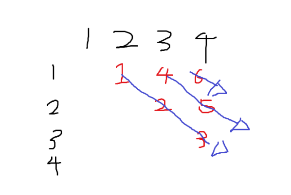

# 📚 WEEK5 공통문제

| 번호 | 문제 링크 | 문제명 | 설명 |
|-----|----------|--------|------|
| 1 | [BOJ 1446 - 지름길](https://www.acmicpc.net/problem/1446) | 지름길 | **(DP, 다익스트라)** 세준이가 운전해야 하는 거리의 최솟값을 구하는 문제 |
     다익스트라 사용안함.
     대신에 list<>형태로 각 cost를 넣고
     map에 key를 도착지점을 넣음
     dp로 dp[i]=dp[i-1]+1넣으면서 만약에 map에 key가 있다면
     꺼내서  start지점+cost 와 dp[i] 값 비교함.

| 2 | [BOJ 11066 - 파일 합치기](https://www.acmicpc.net/problem/11066) | 파일 합치기 | **(DP)** 인접한 두 파일만 합칠 수 있을 때, 모든 파일을 하나로 합치는 최소 비용을 구하는 문제 |
    정말 어려운 문제...이 문제 풀고나서 dp공부하겠다고 맘먹음..
    
    이 문제는 기존 dp와 다르게 1개의 파일은 0으로 처리됨

    즉 30 30 40 을 30 70으로 만들고
    30+70할떼 ==70이 됨
    이후 전체 sum을 더하면서 170이 나옴 
    만약에 100으로 처리하면 30+40일 추가로 알아내서 합해야함--로직 복잡해짐
    
    즉, 1개파일은 0으로 처리되고 이후 부분합으로 처리함.  
    

| 3 | [BOJ 1941 - 소문난 칠공주](https://www.acmicpc.net/problem/1941) | 소문난 칠공주 | **(DFS, 백트래킹)** 25명 학생 중 인접성과 사람 조건을 만족하는 '소문난 칠공주' 경우의 수를 구하는 문제 |
     조합-백트렝킹
     연결-bfs

     백트랙킹으로 1~25 무작위로 좌표 저장하고(순서 상관없이 중복 제외 뽑는 조합합)
     이 좌표를 토대로 연결되어있는지 bfs로 확인하는 문제.

     이문제의 조합 백트랙킹이 어려우면 N과M이라는 백준문제 푸십쇼.
 

| 4 | [BOJ 18223 - 민준이와 마산 그리고 건우](https://www.acmicpc.net/problem/18223) | 민준이와 마산 그리고 건우 | **(다익스트라)** 1번에서 V번까지 최단거리 경로 중 P번을 반드시 들를 수 있는지 판별 ("SAVE HIM" 또는 "GOOD BYE") |
      다익스트라 문제지만
      p를 포함하는지 안하는지만 로직에 넣으면 되는문제
      저같은 경우는 int[0] 에 좌표 저장하고 int[1]에 p가 포함되는지 0,1로 확인함.
      V에 도착 이후, p가 포함되면 return true

      다른 다익스트랑 다르게 dist[next[0]]>=now[1]+next[1]
      등호를 포함해야함! 아니면 가장 짧고 cost가 적은 놈만 답으로나옴
      cost가 같은데 긴 루트는 안나옴옴
     